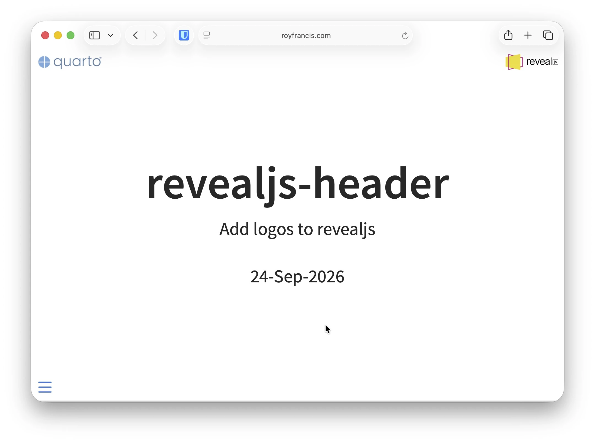

# revealjs-header 

A quarto extension to add header logos to revealjs presentation



- Add one or two logos on the top
- Add a URL as a clickable link
- Adjust height of logos

## Install

- Requires Quarto >=1.2.0
- Install extension to the root of the project 
- Run in the terminal

```
quarto add royfrancis/quarto-revealjs-header
```

## Usage

- Add to filters in yaml metadata

```yaml
filters:
  - revealjs-header
```

- Add parameters to `format: revealjs`.

|Parameter|Description|
|---|---|
|`header-logo-left`|Add a logo to top left|
|`header-logo-right`|Add a logo to top right|
|`header-logo-left-height`|Height of left logo in css units at normal window size. Logos scale up/down together with the slide content, so the on-screen size grows on large screens and shrinks on small ones.|
|`header-logo-right-height`|Height of right logo in css units at normal window size. Logos scale up/down together with the slide content, so the on-screen size grows on large screens and shrinks on small ones.|
|`header-logo-left-url`|Add a clickable link to the left logo. Accepts an absolute URL or a path relative to the `.qmd` file (e.g. `../index.qmd` renders as a link to `../index.html`)|
|`header-logo-right-url`|Add a clickable link to the right logo. Accepts an absolute URL or a path relative to the `.qmd` file (e.g. `../index.qmd` renders as a link to `../index.html`)|

For more information, click [here](https://royfrancis.github.io/quarto-revealjs-header).

## Acknowledgements

- [Quarto](https://quarto.org)
- [shafayetShafee/reveal-header](https://github.com/shafayetShafee/reveal-header)

---

2026 • Roy Francis
